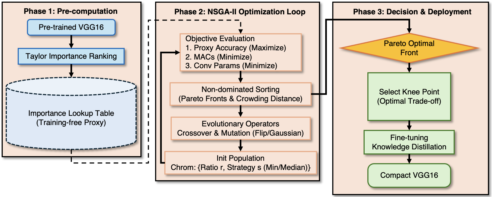

# Adaptive GA-based Structured Pruning

[](https://www.python.org/downloads/)
[](https://pytorch.org/)
[](https://opensource.org/licenses/MIT)

Official implementation of **"Layer-wise Adaptive Structured Pruning via Genetic Algorithms with Taylor-based Proxy Fitness"**

## Highlights

- 🎯 **92.49% accuracy** on CIFAR-10 with **73% MACs reduction**
- 🧬 Novel **layer-wise hybrid strategy** combining Min-Importance and Median-Rank pruning
- ⚡ **Training-free** Taylor-based proxy fitness for efficient search
- 🛡️ Robust against **Layer Collapse** under aggressive compression

## Overview

<p align="center">
  
</p>

We propose an adaptive structured pruning framework that jointly optimizes:
- **How much** to prune (layer-wise pruning ratios)
- **How** to prune (Min-Importance vs. Median-Rank strategy per layer)

Unlike rigid global pruning heuristics, our method uses NSGA-II to discover Pareto-optimal solutions balancing accuracy, MACs, and model size.

## Results

### CIFAR-10 (VGG16)

| Method | Accuracy | Acc Drop | Params ↓ | MACs ↓ |
|--------|----------|----------|----------|--------|
| Baseline | 93.62% | - | 0% | 0% |
| L1-Norm | 93.40% | -0.22 | 64.0% | 34.0% |
| HRank | 93.43% | -0.19 | 82.9% | 53.5% |
| **Ours (GA-MO)** | **92.49%** | **-1.13** | **32.3%** | **73.0%** |

### CIFAR-100 (VGG16)

| Method | MACs (G) | MACs ↓ | Accuracy | Acc Drop |
|--------|----------|--------|----------|----------|
| Baseline | 0.33 | 0% | 72.78% | - |
| Global Min | 0.12 | 63.6% | 69.91% | -2.87 |
| **Ours (GA-MO)** | **0.116** | **64.8%** | **71.82%** | **-0.96** |

## Quick Start

### Requirements

- Python 3.10.12
- CUDA-enabled GPU (tested on NVIDIA RTX 4090)

```bash
pip install torch torchvision torchaudio
pip install numpy
pip install opencv-python
pip install torch_pruning
```

### Pre-trained Models

Download baseline checkpoints from Google Drive:

| Model | Dataset | Accuracy | Link |
|-------|---------|----------|------|
| VGG16 | CIFAR-10 | 93.62% | [Download](https://drive.google.com/drive/folders/1l-xspOKsrGxSasfUpyZtyL3q4sP8iHBP?usp=sharing) |
| VGG16 | CIFAR-100 | 72.78% | [Download](https://drive.google.com/drive/folders/1l-xspOKsrGxSasfUpyZtyL3q4sP8iHBP?usp=sharing) |

### Usage

```bash
jupyter notebook adaptive-ga-pruning.ipynb
```

The notebook includes:
1. Taylor importance score computation
2. Single-objective GA (GA-SO) optimization
3. Multi-objective NSGA-II (GA-MO) optimization
4. Fine-tuning with Knowledge Distillation

## Method

### Search Space
Each chromosome encodes both pruning ratios and strategies:
```
z = {(r₁, s₁), (r₂, s₂), ..., (rₗ, sₗ)}
```
where `rₗ ∈ (0,1]` is the retention ratio and `sₗ ∈ {Min, Median}` is the pruning strategy.

### Multi-Objective Optimization
We optimize three objectives simultaneously:
- `f_acc`: Negative proxy accuracy (minimize)
- `f_mac`: Computational cost (minimize)
- `f_param`: Parameter count (minimize)

## Citation

> 📝 **Paper Status:** Under review at IJEECS

*Citation will be provided once the paper is published.*

## License

This project is licensed under the MIT License - see the [LICENSE](LICENSE) file for details.

## Acknowledgments

- Faculty of Computer Science, University of Information Technology, VNU-HCM
- NVIDIA RTX 4090 GPU for experiments
- [pytorch-pruning](https://github.com/jacobgil/pytorch-pruning) by Jacob Gildenblat - Reference implementation for filter pruning utilities
