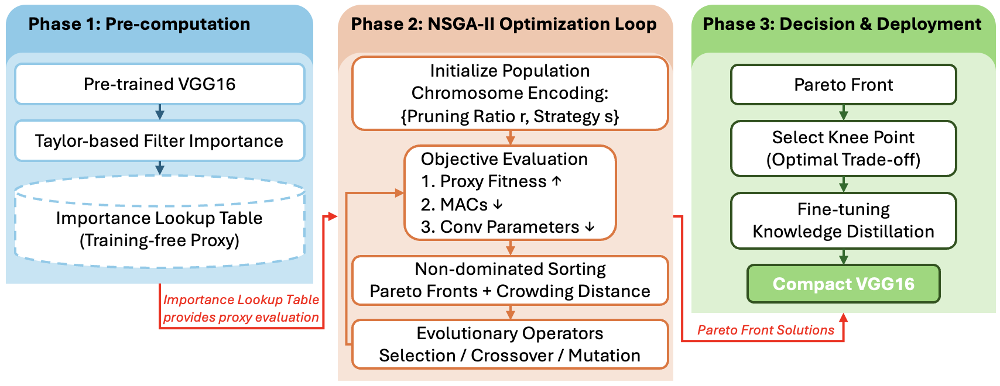

# Adaptive GA-based Structured Pruning

[](https://www.python.org/downloads/)
[](https://pytorch.org/)
[](https://opensource.org/licenses/MIT)
[](#citation)

Official implementation of **"Layer-wise Adaptive Structured Pruning via Genetic Algorithms with Taylor-based Proxy Fitness"** — accepted at *Indonesian Journal of Electrical Engineering and Computer Science (IJEECS), 2026*.

## Highlights

- 🎯 **92.78 ± 0.28% accuracy** on CIFAR-10 (over 50 independent search runs) with **70.0 ± 3.2% MACs reduction**
- 🧬 Novel **layer-wise hybrid strategy** jointly optimizing pruning ratios AND strategies (Min-Importance / Median-Rank)
- ⚡ **Training-free** Taylor-based proxy fitness — entire NSGA-II search completes in **under 15 seconds** on RTX 4090
- 🛡️ Robust against **Layer Collapse** under aggressive compression

## Overview

<p align="center">
  
</p>

We propose an adaptive structured pruning framework that jointly optimizes:
- **How much** to prune (layer-wise pruning ratios `r_l ∈ (0,1]`)
- **How** to prune (Min-Importance vs. Median-Rank strategy `s_l` per layer)

Unlike rigid global pruning heuristics, our method uses NSGA-II to discover Pareto-optimal solutions balancing accuracy, MACs, and model size.

## Results

### CIFAR-10 (VGG16)

| Method           | Accuracy (%)     | Params ↓ (%)   | MACs ↓ (%)     |
|------------------|------------------|----------------|----------------|
| Baseline         | 93.62            | 0              | 0              |
| L1-Norm          | 93.40            | 64.0           | 34.2           |
| HRank            | 93.43            | 82.9           | 53.5           |
| ABCPruner        | 93.08            | 88.68          | 73.68          |
| **Ours (GA-SO)** | 92.33            | 31.0           | 73.6           |
| **Ours (GA-MO)** | **92.78 ± 0.28** | **35.3 ± 2.4** | **70.0 ± 3.2** |

GA-MO results are reported as **mean ± std over 50 independent NSGA-II search runs** (see [Reproducibility](#reproducibility)).

### CIFAR-100 (VGG16)

| Method           | MACs (G)  | MACs ↓ (%) | Accuracy (%) | Acc Drop |
|------------------|-----------|------------|--------------|----------|
| Baseline         | 0.33      | 0          | 72.78        | -        |
| Global Min       | 0.12      | 63.6       | 69.91        | -2.87    |
| Global Median    | 0.14      | 57.6       | 71.02        | -1.76    |
| Global Max       | 0.10      | 69.7       | 68.57        | -4.21    |
| **Ours (GA-MO)** | **0.116** | **64.8**   | **71.82**    | **-0.96**|
| **Ours (GA-SO)** | 0.086     | 73.9       | 70.68        | -2.10    |

## Reproducibility

### Environment

- Python 3.10.12
- PyTorch 2.0+ with CUDA
- Hardware tested: NVIDIA RTX 4090 GPU (24 GB VRAM)

```bash
pip install torch torchvision torchaudio
pip install opencv-python
pip install numpy
pip install --upgrade torch_pruning
pip install matplotlib pandas
```

### Hyperparameters

**Data pipeline (VGG16 / CIFAR):**
| Parameter           | Value |
|---------------------|-------|
| Batch size          | 128   |
| Num workers         | 2     |
| Normalization       | mean=[0.485, 0.456, 0.406], std=[0.229, 0.224, 0.225] |
| Train augmentation  | `RandomCrop(32, padding=4)` + `RandomHorizontalFlip()` |
| Classifier type     | `B` — Linear(512, 4096) → Linear(4096, 4096) → Linear(4096, num_classes) |

**Taylor importance pre-computation:**
| Parameter           | Value |
|---------------------|-------|
| Number of epochs    | 1 (single ranking epoch) |
| Layer normalization | Per-layer L2 normalization of accumulated `|activation × gradient|` |

**Single-Objective GA (GA-SO):**
| Parameter                       | Value      |
|---------------------------------|------------|
| Population size                 | 50         |
| Generations                     | 30         |
| Elite ratio                     | 0.2        |
| Crossover                       | Uniform-mask (`rand > 0.5`) |
| Mutation probability            | 0.1        |
| Mutation (ratio gene)           | Gaussian noise σ=0.1, clipped to [0.05, 1.0] |
| Mutation (strategy gene)        | Bit flip   |
| Hard min retention ratio        | 0.10       |
| Channel alignment               | Multiples of 8 |
| MACs soft penalty               | `10·v + 20·v²` if `macs_ratio > target` |
| Structural penalty              | `3·(0.4 - ratio)²` if attenuation<0.2 AND ratio<0.4 |
| Params penalty weight           | 0.10       |
| Target MACs ratio (CIFAR-10)    | 0.20       |
| Random seed (reference run)     | 2001       |

**Multi-Objective NSGA-II (GA-MO):**
| Parameter                       | Value      |
|---------------------------------|------------|
| Population size                 | 50         |
| Generations                     | 30         |
| Crossover                       | Single-point |
| Mutation probability (per gene) | 0.1        |
| Mutation (ratio gene)           | Uniform reinit in [`min_ratio`, 1.0] |
| Mutation (strategy gene)        | Uniform reinit in [0, 1] |
| Hard min retention ratio        | 0.10       |
| Channel alignment               | Multiples of 8 |
| Objectives                      | Maximize proxy-acc; minimize MACs and params |
| Knee-point criterion            | Min Euclidean distance to ideal point in normalized objective space |
| Random seed (reference run)     | 2026       |

**Fine-tuning with Knowledge Distillation (KD):**
| Parameter             | Value |
|-----------------------|-------|
| Epochs                | 150   |
| Optimizer             | SGD   |
| Initial learning rate | 0.01  |
| Momentum              | 0.9   |
| Weight decay          | 5e-4  |
| LR scheduler          | Cosine annealing (`T_max = 150`) |
| Gradient clipping     | `max_norm = 5.0` |
| KD temperature `T`    | 4.0   |
| KD weight `α`         | 0.9 (soft loss) / 0.1 (hard CE) |

**Fine-tuning without KD (for reference):** identical to KD setup except `lr = 0.001` and pure cross-entropy loss.

### Pre-trained Baseline Checkpoints

| Model | Dataset | Accuracy | Link |
|-------|---------|----------|------|
| VGG16 | CIFAR-10 | 93.62% | [Download](https://drive.google.com/drive/folders/1l-xspOKsrGxSasfUpyZtyL3q4sP8iHBP?usp=sharing) |
| VGG16 | CIFAR-100 | 72.78% | [Download](https://drive.google.com/drive/folders/1l-xspOKsrGxSasfUpyZtyL3q4sP8iHBP?usp=sharing) |

### Quick Start

```bash
git clone https://github.com/truongva1111/adaptive-ga-pruning.git
cd adaptive-ga-pruning
jupyter notebook adaptive-ga-pruning.ipynb
```

The notebook performs:
1. **Pre-computation**: Compute Taylor importance scores once and cache them as ranking tables
2. **GA Search (GA-SO / GA-MO)**: Evolve pruning policies in ~15 s on RTX 4090
3. **Knee-Point Selection**: Pick the balanced architecture from the Pareto front (GA-MO only)
4. **Physical pruning** using `torch_pruning`
5. **Fine-tuning** for 150 epochs with Knowledge Distillation

### Reproducing the 50-Run Statistics

The reported `92.78 ± 0.28%` figure is the mean ± std of **50 independent runs of the full pipeline** (ranking → NSGA-II → knee selection → KD fine-tuning). Only the **baseline (teacher) checkpoint is shared** across runs; every run re-seeds RNGs, recomputes its own Taylor ranking tables, evolves its own Pareto front, picks its own knee point, and fine-tunes for 150 epochs with KD.

The full statistical pipeline is implemented as a standalone script for the residual-architecture validation (`resnet56_ga_pruning_std.py`) — the same pattern applies to VGG16. To launch multiple search runs:

```bash
python resnet56_ga_pruning_std.py \
    --dataset CIFAR10 \
    --target_macs 0.30 \
    --pop_size 50 \
    --generations 30 \
    --n_search_runs 50 \
    --seed 42
```

## Citation

If you find this work useful, please cite:

```bibtex
@article{vo2026adaptive,
  title   = {Layer-wise Adaptive Structured Pruning via Genetic Algorithms with Taylor-based Proxy Fitness},
  author  = {Vo, Anh-Truong and Tran, Hoang-Loc and Phan, Dinh-Duy and Vu, Duc-Lung},
  journal = {Indonesian Journal of Electrical Engineering and Computer Science (IJEECS)},
  year    = {2026},
  note    = {Accepted for publication}
}
```

*Volume/issue/page information will be updated once published.*

## License

This project is licensed under the MIT License — see the [LICENSE](LICENSE) file for details.

## Acknowledgments

- **MMLab**, University of Information Technology, Vietnam National University Ho Chi Minh City — computational resources.
- [pytorch-pruning](https://github.com/jacobgil/pytorch-pruning) by Jacob Gildenblat — reference implementation for filter pruning utilities.

## Contact

For questions, please contact: **truongva.18@grad.uit.edu.vn** (Anh-Truong Vo)
or **lungvd@uit.edu.vn** (Duc-Lung Vu, corresponding author).
